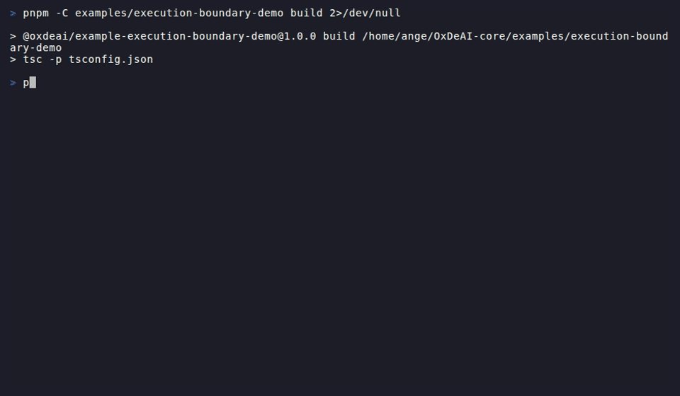

# OxDeAI

[](https://github.com/AngeYobo/oxdeai/actions/workflows/ci.yml)
<!--
[](...)
-->

A deterministic authorization layer that decides whether AI agent actions are allowed to execute before any side effect occurs.

Same intent + state + policy → same decision, everywhere.

Agents can call APIs, provision infrastructure, and move money.
Most systems rely on prompts or checks after the fact.
OxDeAI blocks or authorizes execution **before anything happens**.

Control execution, not just behavior.

---

<p align="center">
  
</p>

---

## TL;DR

Agents propose actions.
OxDeAI decides - deterministically - whether execution is allowed.

No authorization → no execution.

---

## Trust Model

OxDeAI is an execution authorization protocol - not a global authority.

Any system can act as an issuer.
A valid signature is not trust.

Verification guarantees integrity, not authority.

Trust MUST be explicitly configured by the verifier.

In strict mode, missing trust configuration MUST fail closed.

OxDeAI enforces the execution boundary.
Who is trusted is defined outside the protocol, by the verifier.

| Concept | Controlled by |
|---|---|
| Issuer | Any system (policy engine, delegation service, custom authority) |
| Trusted keys | The verifier (trustedKeySets) |
| Execution gate | OxDeAI (after trust is established) |

Correct - trust is explicit:

```ts
verifyAuthorization(auth, {
  mode: "strict",
  trustedKeySets: [...]
});
// ok only if signature is valid AND issuer is trusted
```

Wrong - no trust config, strict mode fails closed:

```ts
verifyAuthorization(auth, { mode: "strict" });
// → invalid (TRUSTED_KEYSETS_REQUIRED)
```

---

## What this looks like



Agent proposed the same action twice. Executed exactly once. Replay blocked at the boundary before any side effect.

---

## Try it in 2 minutes

```bash
git clone https://github.com/AngeYobo/oxdeai.git
cd oxdeai && pnpm install && pnpm build
pnpm -C examples/execution-boundary-demo start
# open http://localhost:3001
```

Runs in under 2 minutes. No config required.

Step through the scenario: agent proposes `charge_wallet(user_123, 10)` twice.
First is allowed. Second is blocked at the authorization boundary before execution.
Both panels update live showing agent intent vs. authorization decision.

---

## Additional examples

To run a full agent integration example:

```
pnpm -C examples/openclaw start
```

This runs a simple OpenClaw agent that provisions a GPU and queries a database, with OxDeAI enforcing authorization before execution.

---

## Why devs care

* stops execution before side effects occur
* prevents replay, loops, and budget leaks at the boundary
* guarantees reproducible decisions (same input → same result)
* produces verifiable authorization artifacts
* works across LangGraph, OpenAI Agents SDK, CrewAI, AutoGen, OpenClaw

---

## What this prevents

* agent executes something you didn’t intend
* budget keeps going after limit
* permissions leak across agents
* duplicate / replayed actions
* decisions that cannot be reproduced or verified

---

## Why this is different

Prompt guardrails → probabilistic
Monitoring → after execution
OxDeAI → before execution, deterministic

Logs explain what happened. Authorization artifacts prove what was allowed.

---

**Validated by frozen conformance vectors, cross-adapter tests, and independent Go/Python verification - continuously validated via CI.**

---

# Core Model

OxDeAI evaluates:

```
(intent, state, policy) → deterministic decision

This evaluation is performed as an explicit decision phase,
separate from execution and enforced before any side effect.
```

* intent: proposed action
* state: deterministic input to evaluation
* policy: static rule set

If ALLOW → emits a signed AuthorizationV1
If DENY → nothing executes (fail-closed)


---

## Decision Layer

Inside OxDeAI, authorization is structured as an explicit decision phase:

(intent, state, policy) → ALLOW | DENY

This is not an implicit check inside execution.
It is a deterministic, standalone decision step evaluated before any side effect is reachable.

Why this matters:

- the same intent can produce different decisions as state evolves
- retries do not bypass the decision boundary
- decision logic does not drift into the agent loop or tool wrappers
- authorization remains explainable and reproducible

Execution only becomes reachable after this decision succeeds.

---

# How It Works

1. Agent proposes an action
2. OxDeAI evaluates (intent, state, policy) in a deterministic decision phase
3. ALLOW → AuthorizationV1 emitted
4. Execution becomes reachable only after verification
5. PEP verifies artifact before execution
6. DENY → execution blocked before side effects

---

# Correctness Guarantees

* deterministic evaluation (same inputs → same decision)
* fail-closed execution (no artifact → no execution)
* evaluation isolation (no shared mutable state across concurrent runs)
* cross-adapter equivalence (same decision across runtimes)

Covered by:

* conformance suite: continuously validated via CI
* property-based tests (D-P1–D-P5, G-D1–G-D3)
* cross-adapter validation (CA-1–CA-10)

---

## Security Note

`verifyEnvelope` does not automatically enforce snapshot ↔ checkpoint state consistency.
Consumers must explicitly compare `stateHash` values to ensure full state continuity.

---

# Delegated Authorization

Delegation behaves like a capability system: authority is explicitly passed, never implicitly inherited.

```text
parent-agent → AuthorizationV1 (tools=[provision_gpu, query_db], budget=1000)
                    ↓
               DelegationV1 (tools=[provision_gpu], max_amount=300)
                    ↓
child-agent → verifyDelegationChain() → execute or DENY
```

Properties:

* strictly narrowing
* single-hop
* locally verifiable
* cryptographically bound (Ed25519)

---

# Validation

Behavior is defined by frozen conformance vectors, not just the reference implementation.

* conformance vectors: continuously validated via CI
* Go + Python harness independently verify DelegationV1
* no oracle / lookup fallback
* cross-adapter deterministic equivalence

---

# Adapter Stack

One enforcement layer, multiple runtimes.

* LangGraph
* OpenAI Agents SDK
* CrewAI
* AutoGen
* OpenClaw

All produce the same result:

```
ALLOW / ALLOW / DENY / verifyEnvelope() => ok
```

---

# Benchmarks

Adds ~80–150µs overhead per action (p50), depending on evaluation and verification path.

Negligible compared to multi-second agent loops.

---

# What OxDeAI Is

* deterministic execution authorization protocol
* explicit decision layer: (intent, state, policy) → allow / deny
* pre-execution gating (no side effect without authorization)
* cryptographic authorization artifacts
* offline-verifiable evidence

---

# What OxDeAI Is Not

* not an agent framework
* not a prompt or output guardrail
* not a monitoring or observability system
* not a runtime heuristic layer

---

# Protocol Status

| Artifact               | Status  |
| ---------------------- | ------- |
| AuthorizationV1        | Stable  |
| DelegationV1           | Stable  |
| VerificationEnvelopeV1 | Stable  |
| ExecutionReceiptV1     | Planned |
---

```
The protocol defines a deterministic decision and authorization surface. Execution is only reachable through valid, verifiable artifacts.
```
---

# Multi-language

Artifacts are portable:

* TypeScript (reference)
* Go
* Python

Verification works across runtimes.

---

# Why This Exists

Agents moved from answering → acting.

Execution is now the critical boundary.

Prompt guardrails shape behavior.
OxDeAI makes a deterministic decision before execution.

```
Prompt guardrails are probabilistic (p < 1).
Authorization is deterministic (p = 1).
```
---

# Contributing

See:

* [CONTRIBUTING.md](./CONTRIBUTING.md)
* [SPEC.md](./SPEC.md)
* [docs/invariants.md](./docs/invariants.md)
* [packages/conformance](./packages/conformance)

---

