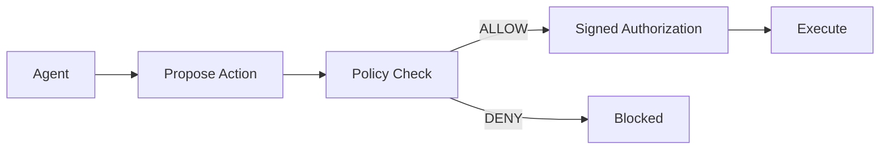
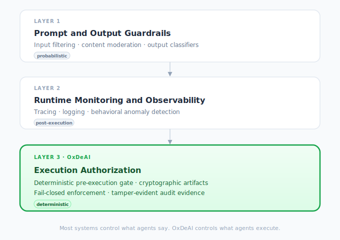

# OxDeAI

A deterministic authorization layer that decides whether AI agent actions are allowed to execute before any side effect occurs.

- Agents can call APIs, provision infrastructure, spend money, execute tools
- Most systems check prompts or logs. Neither blocks execution.
- OxDeAI gates the side effect itself, before it happens, with a verifiable artifact

> If you are building agents that execute real actions, this layer becomes necessary quickly.



---

## TL;DR

Agents propose actions. OxDeAI decides if they execute.

No valid authorization, no execution.

---

## What This Looks Like

```bash
pnpm -C examples/openclaw start
```

```
ALLOW  provision_gpu  budget=320/1000
ALLOW  query_db       budget=640/1000
DENY   provision_gpu  BUDGET_EXCEEDED
verifyEnvelope() => ok
```

Two actions executed. Third blocked before execution. Result is verifiable.

This is the minimal reproducible scenario.

---

## Try It in 2 Minutes

```bash
git clone https://github.com/AngeYobo/oxdeai.git
cd oxdeai && pnpm install && pnpm build
pnpm -C examples/openclaw start
```

Runs in under 2 minutes. No config required.

Swap in `examples/langgraph`, `examples/crewai`, or any other adapter for the same output.

---

## Why Devs Care

- Prevents unintended side effects before they happen
- Deterministic decisions: same `(intent, state)` always produces the same result
- Works across LangGraph, OpenAI Agents SDK, CrewAI, AutoGen, OpenClaw

---

## What This Prevents

- **Unintended side effects**: model output reaches an external system before policy is checked
- **Budget overruns**: agent keeps spending after limits are reached because the check was post-execution
- **Stale state execution**: concurrent agent evaluates against already-mutated shared state
- **Permission leakage**: child agent inherits broader authority than the parent intended
- **Replay and duplicate actions**: same authorized action executes twice because `auth_id` was not consumed
- **Silent failures**: a DENY produces no artifact, leaving nothing to verify or audit

---

## Why This Is Different

```
Prompt guardrails  →  probabilistic, upstream of execution
Monitoring         →  after execution, cannot undo side effects
OxDeAI             →  before execution, deterministic
```

Logs explain what happened. Authorization artifacts prove what was allowed.

Validated by frozen conformance vectors (139 assertions), cross-adapter tests, and independent Go/Python verification.

---

## Quickstart

Runs in under 2 minutes.

### Requirements

- Node.js >= 20
- pnpm >= 9

```bash
git clone https://github.com/AngeYobo/oxdeai.git
cd oxdeai
corepack enable && corepack prepare pnpm@9.12.2 --activate
pnpm install
pnpm build
pnpm -C examples/openai-tools start
```

### Core concept

```typescript
import { OxDeAIGuard } from "@oxdeai/guard";

const guard = OxDeAIGuard({ engine, getState, setState });

// execute is only called when the action is authorized
const result = await guard(proposedAction, async () => {
  return executeAction(); // never reached on DENY
});
```

For runtime-specific bindings:

```typescript
import { createLangGraphGuard } from "@oxdeai/langgraph";
// or: createCrewAIGuard, createOpenAIAgentsGuard, createAutoGenGuard, createOpenClawGuard

const guard = createLangGraphGuard({ engine, getState, setState, agentId: "my-agent" });

const result = await guard(
  { name: "provision_gpu", args: { asset: "a100" }, id: "call-1" },
  async () => provisionGpu("a100")
);
```

On `DENY`, `OxDeAIDenyError` is thrown and the callback is never called.

---

## Protocol Model

OxDeAI follows a standard PDP/PEP architecture:

- **PDP** (Policy Decision Point): evaluates `(intent, state)` → decision
- **PEP** (Policy Enforcement Point): verifies `AuthorizationV1` or `DelegationV1` → executes or denies

The PEP MUST NOT execute without a valid authorization artifact.

Every allowed action produces a portable artifact. The executor verifies signature, intent binding, state binding, and policy binding. No control plane required at execution time.

| Artifact | Issued by | Scope |
|---|---|---|
| `AuthorizationV1` | PDP (policy evaluation) | defined by policy |
| `DelegationV1` | delegating principal | subset of parent `AuthorizationV1` |

---

## Protocol Status

| Artifact | Status | Notes |
|---|---|---|
| `AuthorizationV1` | Stable | Ed25519-signed, fully conformance-backed, cross-language verified |
| `DelegationV1` | Stable | Ed25519-signed, conformance-backed, independent harness verification |
| `VerificationEnvelopeV1` | Stable | Snapshot + audit chain, offline verifiable |
| `ExecutionReceiptV1` | Planned | Deterministic execution receipts, Merkle batching (v3.x) |

Protocol spec: [`SPEC.md`](./SPEC.md) · Invariants: [`docs/invariants.md`](./docs/invariants.md) · Conformance: [`packages/conformance`](./packages/conformance)

---

## How It Works

1. A runtime proposes an action.
2. OxDeAI canonicalizes and evaluates `(intent, state)` deterministically.
3. If policy allows, OxDeAI emits an `AuthorizationV1` artifact.
4. The PEP executes only when a valid artifact is present.
5. If policy denies, execution is blocked before any side effect occurs.
6. Post-execution evidence can be packaged into a `VerificationEnvelopeV1` for offline verification.

---

## Delegated Authorization

A principal holding a valid `AuthorizationV1` can delegate a strictly narrowed subset of that authority to a child agent using `DelegationV1`.

```
parent-agent  →  AuthorizationV1   (tools=[provision_gpu, query_db], budget=1000)
                      ↓ creates
                 DelegationV1      (tools=[provision_gpu], max_amount=300, expiry=60s)
                      ↓ presented by
child-agent   →  PEP verifyDelegation()
                      ↓
                 Execution (within child scope only)
```

Key properties:

- **Strictly narrowing** - scope, amount, and expiry can only be reduced, never expanded
- **Single-hop** - a `DelegationV1` cannot itself be re-delegated
- **Locally verifiable** - no control plane required at execution time
- **Cryptographically bound** - Ed25519-signed, tied to a specific parent `AuthorizationV1` by hash

```typescript
import { createDelegation, verifyDelegation } from "@oxdeai/core";

const delegation = createDelegation(parentAuth, {
  delegatee: "child-agent",
  scope: { tools: ["provision_gpu"], max_amount: 300 },
  expiry: Date.now() + 60_000,
  kid: "key-1",
}, privateKeyPem);

const result = verifyDelegation(delegation, parentAuth, {
  trustedKeySets: [keyset],
  now: Date.now(),
});
// result.ok === true  → execute
// result.ok === false → DENY, tool blocked
```

Demo: [`examples/delegation`](./examples/delegation)
Spec: [`docs/spec/delegation-v1.md`](./docs/spec/delegation-v1.md)

---

## Correctness Guarantees

Behavior is defined by frozen conformance vectors, not just the reference implementation.

- **Deterministic evaluation**: `(intent, state, policy) → decision` is pure; same inputs always produce the same result
- **Fail-closed execution**: no execution path bypasses the authorization gate; missing or invalid artifact throws immediately
- **Evaluation isolation**: each evaluation receives a `structuredClone` of shared state; concurrent calls cannot corrupt each other's policy context (invariant I6)
- **Cross-adapter equivalence**: identical normalized intent + identical policy state produces identical decisions across all maintained adapters (CA-1 through CA-10)

---

## Validation

- **139 conformance assertions** across intent hashing, authorization, snapshot, audit chain, envelope, and DelegationV1 verification
- **Cross-adapter validation**: `node scripts/validate-adapters.mjs` confirms identical protocol outcomes across all 6 maintained adapters
- **Property-based tests**: D-P1 through D-P5 (delegation scope/hash invariants), G-D1 through G-D3 (guard enforcement), CA-1 through CA-10 (cross-adapter equivalence)
- **Multi-language harness**: Go harness + Python adapter independently verify all vector sets, including Ed25519 signature verification for DelegationV1 with no oracle/lookup fallback
- **Frozen vector policy**: vectors are immutable per protocol version; any behavior change requires a new versioned baseline

References: [`packages/conformance`](./packages/conformance) · [`docs/conformance-vectors.md`](./docs/conformance-vectors.md) · [`docs/invariants.md`](./docs/invariants.md) · [`SPEC.md`](./SPEC.md)

---

## Adapter Stack

`@oxdeai/guard` centralizes the universal PEP security boundary. Runtime adapters are thin bindings - none contain authorization logic.

| Package | Role | Example |
|---|---|---|
| `@oxdeai/guard` | Universal execution guard (PEP) | - |
| `@oxdeai/langgraph` | LangGraph binding | [`examples/langgraph`](./examples/langgraph) |
| `@oxdeai/openai-agents` | OpenAI Agents SDK binding | [`examples/openai-agents-sdk`](./examples/openai-agents-sdk) |
| `@oxdeai/crewai` | CrewAI binding | [`examples/crewai`](./examples/crewai) |
| `@oxdeai/autogen` | AutoGen binding | [`examples/autogen`](./examples/autogen) |
| `@oxdeai/openclaw` | OpenClaw binding | [`examples/openclaw`](./examples/openclaw) |

All maintained adapters implement the same reproducible authorization scenario (`ALLOW` / `ALLOW` / `DENY` / `verifyEnvelope() => ok`):


References:
- [Adapter stack architecture](./docs/integrations/adapter-stack.md)
- [Adapter reference architecture](./docs/adapter-reference-architecture.md)
- [Adapter release notes](./docs/adapter-stack-release-notes.md)
- [Shared demo scenario](./docs/integrations/shared-demo-scenario.md)

---

## Authorization Policy Domains

- **Spend authorization** - enforce per-action and cumulative spend limits before execution ([case study](./docs/cases/api-cost-containment.md))
- **Infrastructure authorization** - gate GPU allocation, cloud resource creation, and database operations ([case study](./docs/cases/infrastructure-provisioning-control.md))
- **Workflow authorization** - deterministic authorization gates for multi-step agent pipelines
- **Bounded execution policies** - velocity limits, concurrency caps, replay protection, and kill-switch enforcement

---

## Benchmarks

OxDeAI adds a deterministic authorization boundary with bounded inline overhead.

On the tested machine (latest full-suite run, `bench/outputs/run-2026-03-11-12-25-55.json`):

| Mode | p50 overhead | mean overhead |
|---|---|---|
| `best-effort` | +14.8 µs | +21.8 µs |
| `strict` | +16.6 µs | +25.2 µs |

Overhead measured as `protectedPath - baselinePath` on a single worker. Results depend on hardware, runtime, and workload.

Full benchmark methodology: [`bench/README.md`](./bench/README.md) · Run write-up: [`bench/BENCHMARK_SUMMARY.md`](./bench/BENCHMARK_SUMMARY.md) · Announcement: [`docs/benchmark-announcement.md`](./docs/benchmark-announcement.md)

---

## Validation Snapshot

Latest local validation (2026-03-20):

- `pnpm build` - pass
- `pnpm -C packages/conformance validate` - pass (139 assertions)
- `pnpm -r test` - pass (all adapter tests pass)
- `node scripts/validate-adapters.mjs` - pass (6/6 adapters)
- `pnpm -C examples/openai-tools start` - `ALLOW`, `ALLOW`, `DENY`, envelope `ok`
- `pnpm -C examples/langgraph start` - `ALLOW`, `ALLOW`, `DENY`, envelope `ok`
- `pnpm -C examples/crewai start` - `ALLOW`, `ALLOW`, `DENY`, envelope `ok`
- `pnpm -C examples/openai-agents-sdk start` - `ALLOW`, `ALLOW`, `DENY`, envelope `ok`
- `pnpm -C examples/autogen start` - `ALLOW`, `ALLOW`, `DENY`, envelope `ok`
- `pnpm -C examples/openclaw start` - `ALLOW`, `ALLOW`, `DENY`, envelope `ok`
- `pnpm -C examples/delegation start` - `ALLOW`, `ALLOW`, `DENY`, `DENY`

DelegationV1 conformance vectors include independent Ed25519 verification in Go and Python harnesses, with no oracle/lookup pattern.

Adapter validation references: [adapter-validation.md](./docs/integrations/adapter-validation.md) · [adoption-checklist.md](./docs/integrations/adoption-checklist.md)

Protocol invariants are mapped to implementation tests and property-based coverage in [docs/invariants.md](./docs/invariants.md).

---

## Repo Layout

Protocol packages:
- [`packages/core`](./packages/core) - protocol reference implementation (`PolicyEngine`, `AuthorizationV1`, audit chain, snapshot, envelope)
- [`packages/sdk`](./packages/sdk) - integration helpers: intent builders, state builders, conformance utilities
- [`packages/conformance`](./packages/conformance) - frozen test vectors and compatibility validator

PEP enforcement:
- [`packages/guard`](./packages/guard) - universal execution guard; all authorization logic lives here

Runtime adapter packages:
- [`packages/langgraph`](./packages/langgraph) - thin LangGraph binding
- [`packages/openai-agents`](./packages/openai-agents) - thin OpenAI Agents SDK binding
- [`packages/crewai`](./packages/crewai) - thin CrewAI binding
- [`packages/autogen`](./packages/autogen) - thin AutoGen binding
- [`packages/openclaw`](./packages/openclaw) - thin OpenClaw binding

Tooling:
- [`packages/cli`](./packages/cli) - protocol-oriented local tooling (`build`, `verify`, `replay`)

Specs and docs:
- `SPEC.md`, `SECURITY.md`, `PROTOCOL.md`
- Architecture: [`docs/architecture.md`](./docs/architecture.md) · [Why OxDeAI](./docs/architecture/why-oxdeai.md)
- Integrations: [`docs/integrations/README.md`](./docs/integrations/README.md)
- Production wiring: [`docs/pep-production-guide.md`](./docs/pep-production-guide.md)
- Multi-language: [`docs/multi-language.md`](./docs/multi-language.md)

---

## Ecosystem Positioning

OxDeAI operates at the execution authorization layer.

- Layer 1: prompt and model safety
- Layer 2: runtime orchestration and observability
- Layer 3: execution authorization and relying-party enforcement

Most agent safety systems focus on what models say or what runtimes log. OxDeAI focuses on what agents are actually allowed to execute.



---

## Multi-Language

TypeScript is the current reference implementation.

OxDeAI artifacts are portable: Rust, Go, and Python developers can verify `AuthorizationV1`, snapshots, audit chains, and verification envelopes without reusing the TypeScript runtime.

- [`docs/multi-language.md`](./docs/multi-language.md)
- [`docs/conformance-vectors.md`](./docs/conformance-vectors.md)

---

## Release and Roadmap

| Milestone | Status |
|---|---|
| `v1.1` Authorization Artifact | complete |
| `v1.2` Non-Forgeable Verification | complete |
| `v1.3` Guard Adapter + Integration Surface | complete |
| `v1.4` Ecosystem Adoption | complete |
| `v1.5` Developer Experience | complete |
| `v2.x` Delegated Agent Authorization | complete |
| `v3.x` Verifiable Execution Infrastructure | planned |

Full roadmap: [`ROADMAP.md`](./ROADMAP.md) · Release policy: [`RELEASE.md`](./RELEASE.md) · Release checklist: [`docs/release-checklist.md`](./docs/release-checklist.md)

### Version

Protocol stack: `@oxdeai/core` `1.6.0` · `@oxdeai/sdk` `1.3.1` · `@oxdeai/conformance` `1.4.0`

Adapter packages: `@oxdeai/guard` `1.0.2` · `@oxdeai/langgraph` `1.0.1` · `@oxdeai/openai-agents` `1.0.1` · `@oxdeai/crewai` `1.0.1` · `@oxdeai/autogen` `1.0.1` · `@oxdeai/openclaw` `1.0.1`

Tooling: `@oxdeai/cli` `0.2.4`

---

## Contributing

- [`CONTRIBUTING.md`](./CONTRIBUTING.md)
- [`SECURITY.md`](./SECURITY.md)
- [Integrations index](./docs/integrations/README.md)
- [Adapter reference architecture](./docs/adapter-reference-architecture.md)
- [Conformance vectors](./packages/conformance)
