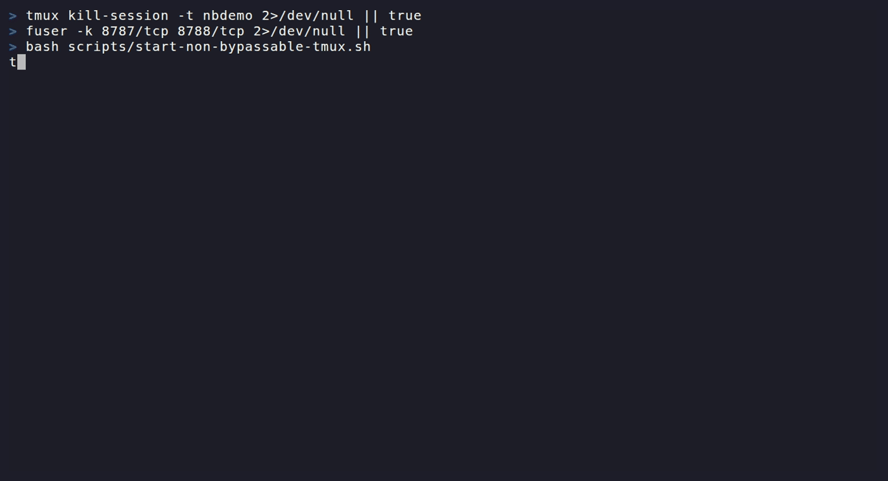

# OxDeAI

[](https://github.com/AngeYobo/oxdeai/actions/workflows/ci.yml)

> **Control execution, not just behavior.**

A deterministic authorization layer that decides whether AI agent actions are allowed to execute **before any side effect occurs**.

```text
(intent + state + policy) → ALLOW | DENY
```

* Same input → same decision
* Fail-closed by default
* No authorization → no execution

Agents can call APIs, provision infrastructure, and move money.
Most systems rely on prompts or checks after the fact.

**OxDeAI enforces execution before anything happens.**

```
No valid authorization
→ no execution path
```

---

## Core Model

OxDeAI introduces an explicit decision phase:

```text
proposal → authorization → execution
```

```text
(intent, state, policy) → deterministic decision
```

* `intent`: proposed action
* `state`: evaluation context
* `policy`: rule set

If `ALLOW` → emits **AuthorizationV1**
If `DENY` → execution is unreachable

---

## Execution Boundary

OxDeAI enforces a strict invariant:

> **No authorization → no execution**

All tool calls **MUST** pass through the PEP Gateway:

* authorization verified before execution
* intent hash must match canonical input
* replay protection enforced
* fail-closed by default

There is **no execution path outside the boundary**.

---

## Non-Bypassable Execution Demo

The agent cannot call tools directly.
All execution goes through a **PEP Gateway**.

```text
Agent → Gateway → Protected Upstream
       ↘ direct call → 403
```

### Expected outcomes

* `ALLOW` → executed
* `DENY` → blocked
* `REPLAY` → blocked
* `BYPASS` → rejected

> **No valid authorization → no execution path**


---

### Run it

```bash
export UPSTREAM_EXECUTOR_TOKEN=demo-internal-token

node examples/non-bypassable-demo/protected-upstream.mjs
node examples/non-bypassable-demo/pep-gateway.mjs
node examples/non-bypassable-demo/agent.mjs
```

---

## Why This Matters

Without an execution boundary:

* retries duplicate side effects
* budgets leak
* permissions drift
* control lives inside the model loop

You are relying on **best-effort enforcement**.

**OxDeAI makes execution conditional.**

---

## How It Works

1. Agent proposes an action
2. OxDeAI evaluates `(intent, state, policy)`
3. `ALLOW` → AuthorizationV1 issued
4. Gateway verifies authorization
5. Execution becomes reachable

`DENY` → blocked before any side effect

---

## What This Prevents

* unintended execution
* duplicate or replayed actions
* budget overruns
* permission leakage
* non-reproducible decisions

---

## Why This Is Different

* Prompt guardrails → probabilistic
* Monitoring → after execution
* **OxDeAI → deterministic, before execution**

Logs explain what happened.
Authorization artifacts prove what was allowed.

---

## Determinism & Proof

OxDeAI is validated through **verifiable invariants**, not claims:

* frozen canonicalization vectors
* cross-language verification (TypeScript / Go / Python)
* conformance suite (CI validated)
* cross-adapter equivalence

```bash
pnpm test:vectors:all
```

All implementations produce **identical canonical bytes and hashes**.

---

## Specification

OxDeAI is a protocol composed of:

* **Canonicalization** → deterministic bytes
* **ETA Core** → decision function
* **Conformance** → verification rules
* **PEP Gateway** → enforcement boundary

→ **Implementation paths**
- [`packages/core/src/`](./packages/core/src)
- [`packages/conformance/`](./packages/conformance)
- [`docs/spec/`](./docs/spec)

Document model:
- `docs/spec/**` — normative protocol definitions
- `docs/**` — non-normative guides and examples; if there is a conflict, `docs/spec/**` wins

---

## Trust Model

OxDeAI is **not a global authority**.

* Any system can issue authorization
* Signature ≠ trust
* Trust is configured by the verifier

```ts
verifyAuthorization(auth, {
  mode: "strict",
  trustedKeySets: [...],
});
```

> No trust configuration → fail closed

| Concept        | Controlled by |
| -------------- | ------------- |
| Issuer         | Any system    |
| Trusted keys   | Verifier      |
| Execution gate | OxDeAI        |

---

## Security Authorization Gate (CI)

The repository itself is protected by a deterministic pre-merge authorization boundary.

```text
findings + exceptions + policy → ALLOW | DENY
```

* No valid exception → no merge path
* High/critical findings → always DENY

The gate can emit a **verifiable decision artifact** (integrity proof).

> Same principle:
> No valid justification → no merge
> No valid authorization → no execution

---

## Quick Start (2 min)

**Prereqs:** Node.js 20+, pnpm 9+

```bash
git clone https://github.com/AngeYobo/oxdeai.git
cd oxdeai
pnpm install
pnpm build

export OXDEAI_ENGINE_SECRET=test-secret-must-be-at-least-32-chars!!
pnpm -C examples/execution-boundary-demo start
```

Open: [http://localhost:3001](http://localhost:3001)

---

## Additional Example

```bash
export OXDEAI_ENGINE_SECRET=test-secret-must-be-at-least-32-chars!!
pnpm -C examples/openclaw start
```

Runs an OpenClaw agent with enforced execution authorization.

---

## Delegated Authorization

Delegation behaves like a capability system:

```text
parent → AuthorizationV1 (budget=1000)
        ↓
   DelegationV1 (max=300)
        ↓
child → verifyDelegationChain() → execute / DENY
```

Properties:

* strictly narrowing
* single-hop
* locally verifiable
* cryptographically bound (Ed25519)

---

## Guarantees

* deterministic evaluation
* fail-closed execution
* replay protection
* evaluation isolation
* cross-runtime equivalence

---

## Benchmarks

* ~80–150µs overhead per action (p50)
* negligible vs agent execution time

---

## Adapter Ecosystem

Works across:

* LangGraph
* OpenAI Agents SDK
* CrewAI
* AutoGen
* OpenClaw

All produce identical outcomes:

```text
ALLOW / ALLOW / DENY / verifyEnvelope() => ok
```

---

## What OxDeAI Is

* execution authorization protocol
* deterministic decision layer
* pre-execution enforcement
* cryptographic authorization artifacts

---

## What OxDeAI Is Not

* not an agent framework
* not a prompt guardrail
* not a monitoring system
* not heuristic runtime logic

---

## Protocol Status

| Artifact               | Status  |
| ---------------------- | ------- |
| AuthorizationV1        | Stable  |
| DelegationV1           | Stable  |
| VerificationEnvelopeV1 | Stable  |
| ExecutionReceiptV1     | Planned |

---

## Multi-language Support

Artifacts are portable:

* TypeScript (reference)
* Go
* Python

Verification works across runtimes.

---

## Why This Exists

Agents moved from **answering → acting**.

Execution is now the **risk surface**.

* Prompt guardrails shape behavior
* OxDeAI controls execution

```text
Probabilistic control < Deterministic authorization
```

---

## Contributing

* [CONTRIBUTING.md](./CONTRIBUTING.md)
* [`docs/spec`](./docs/spec)
* [`packages/conformance`](./packages/conformance)

---

## TL;DR

Agents propose actions.
OxDeAI decides if they can execute.

> **No authorization → no execution.**
