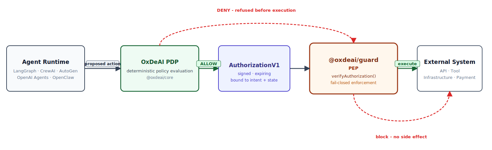
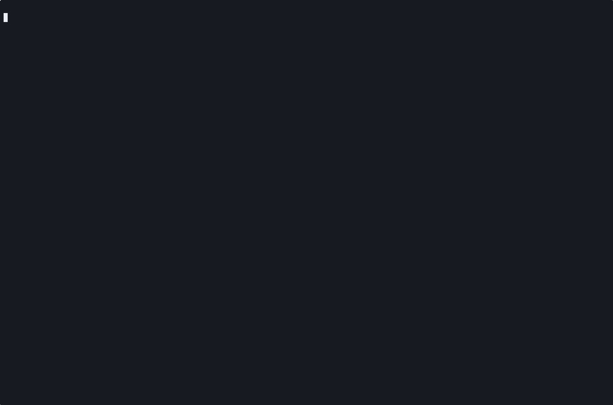

# OxDeAI

Deterministic execution authorization protocol for autonomous systems.

**OxDeAI is the execution authorization layer for AI agents.**

Before an agent executes an external action (API call, infrastructure provisioning, payment, or tool execution), OxDeAI evaluates whether the action is allowed and emits a cryptographically verifiable authorization artifact.

---

## TL;DR

Agents can trigger real-world side effects:

- API calls
- infrastructure provisioning
- payments
- external tool execution

OxDeAI introduces a deterministic authorization boundary before any of these execute:

```text
Agent Runtime  →  OxDeAI authorization  →  tool execution
```

If policy denies the action, the action never executes.

---

## Why OxDeAI Exists

Most AI guardrail systems focus on prompts or model outputs. OxDeAI focuses on the execution authorization boundary.

The critical question is deterministic:

> Is this action allowed to execute under the current policy state?

Instead of monitoring behavior after execution, OxDeAI enforces pre-execution authorization. The engine evaluates `(intent, state)` and emits a cryptographically verifiable `AuthorizationV1` artifact before any external action occurs.

> Logs are narratives. Authorization artifacts are proofs.

---

## How It Works



- Runtimes propose actions.
- OxDeAI evaluates deterministically against the current policy state.
- The PEP allows or blocks execution before any side effect occurs.

---

## Quick Demo



```bash
pnpm -C examples/openclaw start
```

Expected result:

- `ALLOW`
- `ALLOW`
- `DENY`
- `verifyEnvelope() => ok`

Two proposed actions are authorized, the third is refused before execution, and the resulting evidence verifies offline.

---

## Key Properties

- Deterministic policy evaluation - same `(intent, state)` always produces the same decision
- Pre-execution authorization - no side effect without a valid `AuthorizationV1` artifact
- Cryptographic authorization artifacts - Ed25519-signed, non-forgeable
- Fail-closed execution gating - `ALLOW` without a valid artifact throws `OxDeAIAuthorizationError`
- Tamper-evident audit chains - hash-chained events, stateless verifiability
- Offline verifiable evidence - snapshot + audit chain packaged as a `verificationEnvelope`

---

## Adapter Stack

`@oxdeai/guard` centralizes all PEP security logic. Runtime adapters are thin bindings - none contain authorization logic. Adopting a new runtime requires only a thin adapter, not a new authorization implementation.

| Package | Role | Example |
|---|---|---|
| `@oxdeai/guard` | Universal execution guard (PEP) | - |
| `@oxdeai/langgraph` | LangGraph binding | [`examples/langgraph`](./examples/langgraph) |
| `@oxdeai/openai-agents` | OpenAI Agents SDK binding | [`examples/openai-agents-sdk`](./examples/openai-agents-sdk) |
| `@oxdeai/crewai` | CrewAI binding | [`examples/crewai`](./examples/crewai) |
| `@oxdeai/autogen` | AutoGen binding | [`examples/autogen`](./examples/autogen) |
| `@oxdeai/openclaw` | OpenClaw binding | [`examples/openclaw`](./examples/openclaw) |

All maintained adapters implement the same reproducible authorization scenario (`ALLOW` / `ALLOW` / `DENY` / `verifyEnvelope() => ok`):


References:
- [Adapter stack architecture](./docs/integrations/adapter-stack.md)
- [Adapter reference architecture](./docs/adapter-reference-architecture.md)
- [Adapter release notes](./docs/adapter-stack-release-notes.md)
- [Shared demo scenario](./docs/integrations/shared-demo-scenario.md)

---

## Use Cases

- **API cost containment** - enforce per-action and cumulative spend limits before execution ([case study](./docs/cases/api-cost-containment.md))
- **Infrastructure provisioning control** - gate GPU allocation, cloud resource creation, and database operations ([case study](./docs/cases/infrastructure-provisioning-control.md))
- **Autonomous workflow execution** - deterministic authorization gates for multi-step agent pipelines
- **Bounded agent operations** - velocity limits, concurrency caps, and kill-switch enforcement

---

## Benchmarks

OxDeAI adds a deterministic authorization boundary with bounded inline overhead.

On the tested machine (latest full-suite run, `bench/outputs/run-2026-03-11-12-25-55.json`):

| Mode | p50 overhead | mean overhead |
|---|---|---|
| `best-effort` | +14.8 µs | +21.8 µs |
| `strict` | +16.6 µs | +25.2 µs |

Overhead measured as `protectedPath - baselinePath` on a single worker. Results depend on hardware, runtime, and workload.

Full benchmark methodology: [`bench/README.md`](./bench/README.md) · Run write-up: [`bench/BENCHMARK_SUMMARY.md`](./bench/BENCHMARK_SUMMARY.md) · Announcement: [`docs/benchmark-announcement.md`](./docs/benchmark-announcement.md)

---

## Validation Snapshot

Latest local validation (2026-03-15):

- `pnpm build` - pass
- `pnpm -C packages/conformance validate` - pass (94 assertions)
- `pnpm -r test` - pass (all adapter tests pass)
- `node scripts/validate-adapters.mjs` - pass (6/6 adapters)
- `pnpm -C examples/openai-tools start` - `ALLOW`, `ALLOW`, `DENY`, envelope `ok`
- `pnpm -C examples/langgraph start` - `ALLOW`, `ALLOW`, `DENY`, envelope `ok`
- `pnpm -C examples/crewai start` - `ALLOW`, `ALLOW`, `DENY`, envelope `ok`
- `pnpm -C examples/openai-agents-sdk start` - `ALLOW`, `ALLOW`, `DENY`, envelope `ok`
- `pnpm -C examples/autogen start` - `ALLOW`, `ALLOW`, `DENY`, envelope `ok`
- `pnpm -C examples/openclaw start` - `ALLOW`, `ALLOW`, `DENY`, envelope `ok`

Adapter validation references: [adapter-validation.md](./docs/integrations/adapter-validation.md) · [adoption-checklist.md](./docs/integrations/adoption-checklist.md)

---

## Repo Layout

Protocol packages:
- [`packages/core`](./packages/core) - protocol reference implementation (`PolicyEngine`, `AuthorizationV1`, audit chain, snapshot, envelope)
- [`packages/sdk`](./packages/sdk) - integration helpers: intent builders, state builders, conformance utilities
- [`packages/conformance`](./packages/conformance) - frozen test vectors and compatibility validator

PEP enforcement:
- [`packages/guard`](./packages/guard) - universal execution guard; all authorization logic lives here

Runtime adapter packages:
- [`packages/langgraph`](./packages/langgraph) - thin LangGraph binding
- [`packages/openai-agents`](./packages/openai-agents) - thin OpenAI Agents SDK binding
- [`packages/crewai`](./packages/crewai) - thin CrewAI binding
- [`packages/autogen`](./packages/autogen) - thin AutoGen binding
- [`packages/openclaw`](./packages/openclaw) - thin OpenClaw binding

Tooling:
- [`packages/cli`](./packages/cli) - protocol-oriented local tooling (`build`, `verify`, `replay`)

Specs and docs:
- `SPEC.md`, `SECURITY.md`, `PROTOCOL.md`
- Architecture: [`docs/architecture.md`](./docs/architecture.md) · [Why OxDeAI](./docs/architecture/why-oxdeai.md)
- Integrations: [`docs/integrations/README.md`](./docs/integrations/README.md)
- Production wiring: [`docs/pep-production-guide.md`](./docs/pep-production-guide.md)
- Multi-language: [`docs/multi-language.md`](./docs/multi-language.md)

---

## Ecosystem Positioning

Agent safety stacks are emerging in three layers:


OxDeAI operates at layer 3. Most agent safety systems focus on what models say or what runtimes log. OxDeAI focuses on what agents are actually allowed to execute.

---

## Quickstart

### Requirements

- Node.js >= 20
- pnpm >= 9

```bash
git clone https://github.com/AngeYobo/oxdeai.git
cd oxdeai
corepack enable && corepack prepare pnpm@9.12.2 --activate
pnpm install
pnpm build
pnpm -C examples/openai-tools start
```

### Core concept

```typescript
import { OxDeAIGuard } from "@oxdeai/guard";

const guard = OxDeAIGuard({ engine, getState, setState });

// execute is only called when the action is authorized
const result = await guard(proposedAction, async () => {
  return executeAction(); // never reached on DENY
});
```

For runtime-specific bindings:

```typescript
import { createLangGraphGuard } from "@oxdeai/langgraph";
// or: createCrewAIGuard, createOpenAIAgentsGuard, createAutoGenGuard, createOpenClawGuard

const guard = createLangGraphGuard({ engine, getState, setState, agentId: "my-agent" });

const result = await guard(
  { name: "provision_gpu", args: { asset: "a100" }, id: "call-1" },
  async () => provisionGpu("a100")
);
```

On `DENY`, `OxDeAIDenyError` is thrown and the callback is never called.

---

## Multi-Language

TypeScript is the current reference implementation. Rust, Go, and Python developers can verify OxDeAI artifacts today (`AuthorizationV1`, snapshots, audit chains, verification envelopes).

- [`docs/multi-language.md`](./docs/multi-language.md)
- [`docs/conformance-vectors.md`](./docs/conformance-vectors.md)

---

## Release and Roadmap

| Milestone | Status |
|---|---|
| `v1.1` Authorization Artifact | complete |
| `v1.2` Non-Forgeable Verification | complete |
| `v1.3` Guard Adapter + Integration Surface | complete |
| `v1.4` Ecosystem Adoption | complete |
| `v1.5` Developer Experience | complete |
| `v2.x` Delegated Agent Authorization | next |

### v1.4 - Ecosystem Adoption

Delivered the universal adapter layer:

- `@oxdeai/guard` - single PEP package shared by all adapters
- 5 runtime adapter packages: `@oxdeai/langgraph`, `@oxdeai/openai-agents`, `@oxdeai/crewai`, `@oxdeai/autogen`, `@oxdeai/openclaw`
- all adapter examples migrated to use adapter packages
- integration documentation for all maintained adapters: [`docs/integrations/`](./docs/integrations/)
- cross-adapter validation: `node scripts/validate-adapters.mjs`
- shared adapter contract: [`docs/adapter-contract.md`](./docs/adapter-contract.md)
- shared demo scenario (`ALLOW` / `ALLOW` / `DENY` / `verifyEnvelope() => ok`): [`docs/integrations/shared-demo-scenario.md`](./docs/integrations/shared-demo-scenario.md)
- case studies: [API cost containment](./docs/cases/api-cost-containment.md) · [infrastructure provisioning control](./docs/cases/infrastructure-provisioning-control.md)
- release notes: [`docs/adapter-stack-release-notes.md`](./docs/adapter-stack-release-notes.md)

### v1.5 - Developer Experience

Delivered integrator-facing clarity:

- demo GIFs added to README
- quickstart improved
- architecture explainer published: [`docs/architecture/why-oxdeai.md`](./docs/architecture/why-oxdeai.md)
- cross-links between protocol, integrations, and cases
- demos run in under 2 minutes

Full roadmap: [`ROADMAP.md`](./ROADMAP.md) · Release policy: [`RELEASE.md`](./RELEASE.md) · Release checklist: [`docs/release-checklist.md`](./docs/release-checklist.md)

### Version

Protocol stack: `@oxdeai/core` `1.3.1` · `@oxdeai/sdk` `1.3.1` · `@oxdeai/conformance` `1.3.1`

Adapter packages (all `1.0.0`): `@oxdeai/guard` · `@oxdeai/langgraph` · `@oxdeai/openai-agents` · `@oxdeai/crewai` · `@oxdeai/autogen` · `@oxdeai/openclaw`

Tooling: `@oxdeai/cli` `0.2.4`

---

## Contributing

- [`CONTRIBUTING.md`](./CONTRIBUTING.md)
- [`SECURITY.md`](./SECURITY.md)
- [Integrations index](./docs/integrations/README.md)
- [Adapter reference architecture](./docs/adapter-reference-architecture.md)
- [Conformance vectors](./packages/conformance)
