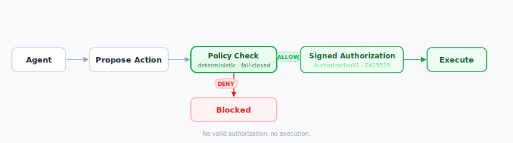

# OxDeAI

A deterministic authorization layer that decides whether AI agent actions are allowed to execute before any side effect occurs.

Agents can call APIs, provision infrastructure, and move money.  
Most systems rely on prompts or checks after the fact.  
OxDeAI blocks or authorizes execution **before anything happens**.

Control execution, not just behavior.

---



---

## TL;DR

Agents propose actions.
OxDeAI decides if they execute.

No valid authorization → no execution.

---

## What this looks like

```bash
pnpm -C examples/openclaw start

ALLOW  provision_gpu  budget=320/1000
ALLOW  query_db       budget=640/1000
DENY   provision_gpu  BUDGET_EXCEEDED

verifyEnvelope() => ok
```

Two actions executed. Third blocked before execution. Result is verifiable.

---

## Try it in 2 minutes

```bash
git clone https://github.com/AngeYobo/oxdeai.git
cd oxdeai && pnpm install && pnpm build
pnpm -C examples/openclaw start
```

Runs in under 2 minutes. No config required.

---

## Why devs care

* prevents unintended side effects before they happen
* deterministic decisions (same input → same result)
* works across LangGraph, OpenAI Agents SDK, CrewAI, AutoGen, OpenClaw

---

## What this prevents

* agent executes something you didn’t intend
* budget keeps going after limit
* permissions leak across agents
* duplicate / replayed actions
* decisions you cannot explain or prove

---

## Why this is different

Prompt guardrails → probabilistic
Monitoring → after execution
OxDeAI → before execution, deterministic

Logs explain what happened. Authorization artifacts prove what was allowed.

---

**Validated by frozen conformance vectors (139 assertions), cross-adapter tests, and independent Go/Python verification.**

---

# Core Model

OxDeAI evaluates:

```
(intent, state, policy) → deterministic decision
```

* intent: proposed action
* state: deterministic input to evaluation
* policy: static rule set

If ALLOW → emits a signed AuthorizationV1
If DENY → nothing executes (fail-closed)

---

# How It Works

1. Agent proposes an action
2. OxDeAI evaluates (intent, state) deterministically
3. ALLOW → AuthorizationV1 emitted
4. PEP verifies artifact
5. Execution allowed only if verification succeeds
6. DENY → execution blocked before side effects

---

# Correctness Guarantees

* deterministic evaluation (same inputs → same decision)
* fail-closed execution (no artifact → no execution)
* evaluation isolation (no shared mutable state across concurrent runs)
* cross-adapter equivalence (same decision across runtimes)

Covered by:

* 139 conformance assertions
* property-based tests (D-P1–D-P5, G-D1–G-D3)
* cross-adapter validation (CA-1–CA-10)

---

# Delegated Authorization

Delegation behaves like a capability system: authority is explicitly passed, never implicitly inherited.

```text
parent-agent → AuthorizationV1 (tools=[provision_gpu, query_db], budget=1000)
                    ↓
               DelegationV1 (tools=[provision_gpu], max_amount=300)
                    ↓
child-agent → verifyDelegation() → execute or DENY
```

Properties:

* strictly narrowing
* single-hop
* locally verifiable
* cryptographically bound (Ed25519)

---

# Validation

Behavior is defined by frozen conformance vectors, not just the reference implementation.

* 139 assertions across protocol artifacts
* Go + Python harness independently verify DelegationV1
* no oracle / lookup fallback
* cross-adapter deterministic equivalence

---

# Adapter Stack

One enforcement layer, multiple runtimes.

* LangGraph
* OpenAI Agents SDK
* CrewAI
* AutoGen
* OpenClaw

All produce the same result:

```
ALLOW / ALLOW / DENY / verifyEnvelope() => ok
```

---

# Benchmarks

Adds ~15–25µs overhead per action (p50).

Negligible compared to multi-second agent loops.

---

# Quickstart

```bash
git clone https://github.com/AngeYobo/oxdeai.git
cd oxdeai
pnpm install
pnpm build
pnpm -C examples/openai-tools start
```

---

# What OxDeAI Is

* deterministic execution authorization protocol
* pre-execution gating (no side effect without authorization)
* cryptographic authorization artifacts
* offline-verifiable evidence

---

# What OxDeAI Is Not

* not a framework
* not a prompt guardrail
* not a monitoring system
* not a billing layer

---

# Protocol Status

| Artifact               | Status  |
| ---------------------- | ------- |
| AuthorizationV1        | Stable  |
| DelegationV1           | Stable  |
| VerificationEnvelopeV1 | Stable  |
| ExecutionReceiptV1     | Planned |

---

# Multi-language

Artifacts are portable:

* TypeScript (reference)
* Go
* Python

Verification works across runtimes.

---

# Why This Exists

Agents moved from answering → acting.

Execution is now the critical boundary.

Prompt guardrails shape behavior.
OxDeAI controls execution.

p < 1 → prompts
p = 1 → authorization

---

# Contributing

See:

* [CONTRIBUTING.md](./CONTRIBUTING.md)
* [SPEC.md](./SPEC.md)
* [docs/invariants.md](./docs/invariants.md)
* [packages/conformance](./packages/conformance)

---

