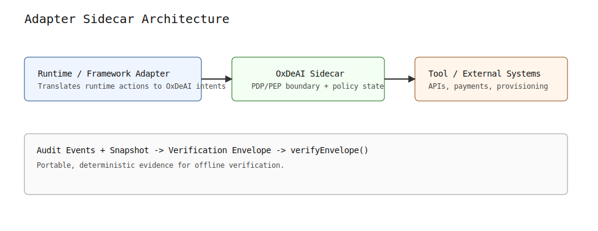

# Adapter Reference Architecture

This document defines the reference integration shape for embedding OxDeAI under agent runtimes.

Shared adapter contract:
- [`docs/adapter-contract.md`](./adapter-contract.md)

## Layer Model

- **PDP (Policy Decision Point)**: deterministic policy evaluation over `(intent, state, policy)`.
- **PEP (Policy Enforcement Point)**: execution boundary that verifies authorization and either executes or refuses side effects.

## Adapter Sidecar Architecture

Related boundary view:
- [`Agent authorization boundary`](./diagrams/agent-authorization-boundary.svg)

Diagram source/editing policy:
- [`docs/diagrams/README.md`](./diagrams/README.md)

## Component Roles

- **Agent runtime**: proposes actions; does not directly authorize side effects.
- **Adapter**: translates runtime-specific action proposals into OxDeAI intent inputs and maps outputs back to runtime conventions.
- **`@oxdeai/guard`**: universal PEP package (`OxDeAIGuard`) that enforces execute-or-refuse behavior around callbacks. All runtime adapters delegate to this package - none contain authorization logic.
- **PDP**: returns deterministic `ALLOW`/`DENY` and emits authorization/state transition data for `ALLOW`.
- **PEP**: verifies authorization constraints (issuer, audience, policy, intent/state binding, expiry, replay) before execution.
- **Verification artifacts**: audit events, canonical snapshot, and envelope provide offline/stateless evidence and replay-grade verification.

## Framework-Agnostic Property

This architecture is framework-agnostic because runtimes interact through the same boundary contract:

- runtime proposes action
- OxDeAI decides and emits authorization artifacts
- PEP enforces authorization before side effects
- artifacts are verified with common stateless verifiers

Framework choice changes adapter code, not protocol semantics.

Adapters MAY sit between raw action surfaces and OxDeAI intent evaluation.
They are responsible for deterministic normalization before policy evaluation so that equivalent actions map to equivalent intents within the integration.
OxDeAI remains the authorization layer at the execution boundary, not the action-expression layer.

Adapters MAY also enrich policy state with deterministic execution context before invoking the OxDeAI PDP.
Examples include execution-history flags, previous sensitive operations, resource-scope transitions, and workflow-phase indicators.
Any such enrichment MUST remain deterministic and reproducible for the same evaluated situation.

## Shared Adapter Contract

The shared adapter contract is documented in [`docs/adapter-contract.md`](./adapter-contract.md).

In that contract, the adapter is responsible for normalization plus authorization-boundary wiring.
The adapter is not the protocol and it is not the runtime.
It sits between the raw action surface and OxDeAI intent/state evaluation.

Current runtime adapter packages in this repository:

| Package | Binding | Factory |
|---|---|---|
| `@oxdeai/langgraph` | LangGraph tool calls (`args`/`id`) | `createLangGraphGuard` |
| `@oxdeai/openai-agents` | OpenAI Agents SDK tool calls (`input`/`call_id`) | `createOpenAIAgentsGuard` |
| `@oxdeai/crewai` | CrewAI tool calls (`args`/`id`) | `createCrewAIGuard` |
| `@oxdeai/autogen` | AutoGen tool calls (`args`/`id`) | `createAutoGenGuard` |
| `@oxdeai/openclaw` | OpenClaw actions (`args`/`step_id`/`workflow_id`) | `createOpenClawGuard` |

All adapters delegate to `@oxdeai/guard`. None contain authorization logic.
