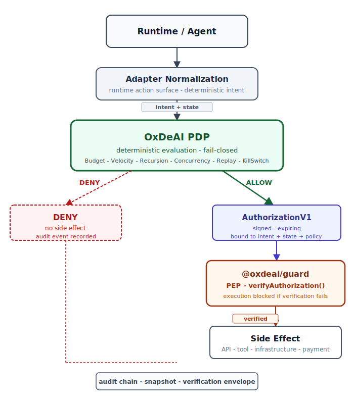

# Why OxDeAI

## Status

Non-normative (developer documentation)


Non-normative positioning. Normative specs are in `SPEC.md` and `docs/spec/`; artifact status is defined there (AuthorizationV1/DelegationV1/PEP Stable; VerificationEnvelope pending; ExecutionReceipt planned).

> Control execution, not just behavior.

OxDeAI enforces deterministic authorization at the execution boundary of autonomous systems. It is not a runtime, orchestration engine, or prompt guardrail layer. It is the protocol and reference stack that decides whether a proposed external action is allowed to execute under the current policy state.

---

## The Problem

Modern agent runtimes can trigger real side effects: external API calls, cloud provisioning, payments, workflow actions, command execution.

A model output is not yet a side effect. A provider call, infrastructure action, or paid tool invocation is. That gap - between what a model proposes and what the runtime executes - is where economic and operational risk becomes real. Existing layers do not close it.

## Why Prompt Guardrails Are Insufficient

Prompt and output guardrails operate upstream from execution. They may reduce unsafe content or shape responses, but they do not guarantee that a side effect is blocked before it occurs.

An autonomous system can produce action proposals that look valid to the runtime and continue to cross tool or provider boundaries unless a dedicated execution gate exists. Guardrails address model behavior. They do not address execution authorization.

OxDeAI addresses the narrower, harder problem: whether a proposed action is authorized to execute **now**, against the current policy state, with a verifiable artifact to prove it.

## The Execution Authorization Boundary

OxDeAI sits between the runtime and the external system.



The control point is pre-execution:

- `DENY` - the side effect does not execute
- `ALLOW` - the engine emits `AuthorizationV1`
- the PEP verifies that authorization artifact before the side effect occurs

No execution happens without a verified `ALLOW`. No `AuthorizationV1` exists without a prior deterministic evaluation.

## Architecture

The architecture separates policy evaluation (PDP) from execution enforcement (PEP).

```text
raw action surface
  -> adapter normalization
  -> deterministic intent
  -> current policy state
  -> PDP evaluation
  -> authorization artifact on ALLOW
  -> PEP verification gate
  -> external system
  -> audit chain + snapshot
  -> verification envelope
```

Key roles:

- **adapter** - maps a runtime-specific action surface into a deterministic intent
- **PDP** - evaluates `(intent, state, policy)` and returns `ALLOW` or `DENY`
- **PEP** - verifies `AuthorizationV1` (or `DelegationV1`) before any side effect
- **evidence path** - preserves snapshot, audit events, and verification envelope for independent verification

## Deterministic Evaluation Model

```
(intent, state, policy) -> deterministic decision
```

The same evaluated situation always produces the same semantic result. The protocol depends on deterministic serialization (canonical JSON), stable verification semantics, and explicit state transitions.

OxDeAI does not require a single universal raw action schema. It requires deterministic normalization within each integration: the adapter's job is to map framework-specific surfaces into a stable intent before evaluation.
All hashes and signature preimages MUST use `canonicalization-v1`.

## Authorization Artifacts

On `ALLOW`, the engine emits `AuthorizationV1`. That artifact binds the authorization decision to:

- the evaluated intent (`intent_hash`)
- the policy identity (`policy_id`)
- the state snapshot hash
- issuer and audience context
- expiry and Ed25519 signature metadata

`AuthorizationV1` is not a post-fact report. It is the pre-execution artifact verified at the PEP boundary before any side effect is permitted.

## Delegated Authorization

Multi-agent systems often need one agent to authorize constrained action by another - a planner delegating to a worker, an orchestrator granting limited authority to a specialized executor.

OxDeAI addresses this with `DelegationV1`: a signed artifact that binds a child agent's authority to a parent `AuthorizationV1` while enforcing strictly narrowing scope.

Key properties:

- delegated scope cannot exceed the parent's granted scope (`tools`, `max_amount`, `max_actions`, `max_depth`)
- delegation expiry cannot exceed parent authorization expiry
- chain verification runs locally at the PEP - no control-plane round-trip required
- single-hop only - `DelegationV1` cannot itself be re-delegated
- fail-closed: any chain violation rejects the path; `setState` is never called on the delegation path

```text
parent agent receives AuthorizationV1
  -> calls createDelegation() with bounded scope + expiry
  -> child agent receives DelegationV1
  -> child PEP calls verifyDelegationChain(parent, delegation, opts)
  -> chain checks: hash binding, delegator match, scope narrowing, expiry ceiling
  -> child executes within delegated scope
```

See [`docs/spec/delegation-v1.md`](../spec/delegation-v1.md) for the full artifact specification and chain verification rules.

## Verification Evidence

OxDeAI preserves a verification path independent of the live runtime:

- **snapshot** - canonical encoding of evaluated policy state
- **audit events** - hash-chained record of proposed actions, decisions, and execution or refusal
- **verification envelope** - packages snapshot plus audit evidence into a portable artifact

`verifyEnvelope()` provides stateless verification of that packaged evidence. It does not require access to the live engine or policy state.

This evidence path supports:

- relying-party and auditor verification
- independent compliance review across org boundaries
- post-execution reasoning about what was evaluated and what was refused

## Integration Model

OxDeAI is interface-agnostic. Action surfaces may include structured tool calls, CLI-style command execution, workflow nodes, MCP-mediated invocation, or framework-specific adapters. Those surfaces are not the protocol. Integrations normalize them into intent before evaluation.

Practical integration sequence:

1. Runtime proposes action
2. Adapter normalizes into deterministic intent
3. Current policy state is supplied to the PDP
4. PDP returns `ALLOW` or `DENY`
5. On `ALLOW`, `AuthorizationV1` is emitted
6. PEP verifies authorization before execution
7. Audit and verification artifacts remain available for later checks

## Canonical Demo Flow

The maintained adapter demos share a single canonical scenario:

```text
action 1  ->  ALLOW
action 2  ->  ALLOW
action 3  ->  DENY   (budget exceeded)
verifyEnvelope() => ok
```

The delegation demo (`examples/delegation`) extends this with a child agent path:

```text
parent receives AuthorizationV1           ->  ALLOW
parent delegates bounded scope to child   ->  ALLOW
child requests tool outside scope         ->  DENY  (scope violation)
child presents expired delegation         ->  DENY  (expiry)
```

The demos differ by runtime surface, not by OxDeAI semantics. Each produces the same protocol outcomes under the same policy model.

Status signals: Canonicalization vectors are locked; AuthorizationV1 / PEP / DelegationV1 are Stable; VerificationEnvelopeV1 pending; ExecutionReceiptV1 planned. Proof points: locked vectors - `docs/spec/test-vectors/canonicalization-v1.json`, `authorization-v1.json`, `pep-vectors-v1.json`, `delegation-vectors-v1.json`.

## Positioning

| Layer | What it does | OxDeAI? |
|---|---|---|
| Prompt guardrails | Shape or filter model outputs | No |
| Agent runtimes / orchestrators | Manage agent lifecycle and tool routing | No |
| OxDeAI PDP | Evaluate proposed actions against policy state | **Yes** |
| OxDeAI PEP | Gate execution against verified authorization | **Yes** |
| OxDeAI evidence path | Preserve verifiable audit artifacts | **Yes** |

OxDeAI does not replace runtimes, orchestration engines, or prompt layers. It enforces the boundary that those layers do not: whether a proposed action is authorized to produce a side effect, with a signed and verifiable artifact as proof.

## References

- [`README.md`](../../README.md)
- [`PROTOCOL.md`](../../PROTOCOL.md)
- [`SPEC.md`](../../SPEC.md)
- [`docs/spec/delegation-v1.md`](../spec/delegation-v1.md)
- [`docs/adapter-contract.md`](../adapter-contract.md)
- [`docs/pep-production-guide.md`](../pep-production-guide.md)
- [`docs/integrations/README.md`](../integrations/README.md)
- [`docs/integrations/shared-demo-scenario.md`](../integrations/shared-demo-scenario.md)
- [`docs/cases/README.md`](../cases/README.md)
