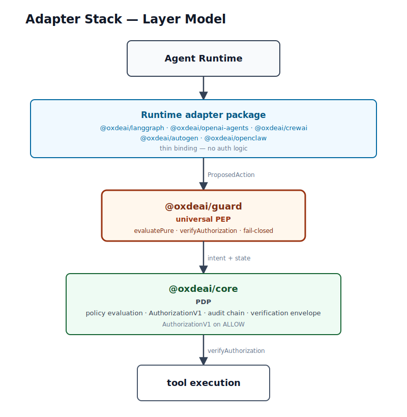

# OxDeAI Adapter Stack

## Status

Non-normative (developer documentation)


This document describes the full adapter layer model and the complete set of runtime adapter packages.

## Layer Model



## Package Roles

### `@oxdeai/core`

Protocol reference implementation. Provides:

- `PolicyEngine` - deterministic policy evaluation
- `AuthorizationV1` - cryptographically verifiable authorization artifact
- `buildAuditChain`, `buildSnapshot`, `buildEnvelope` - tamper-evident evidence
- `verifyEnvelope` - offline stateless verification

### `@oxdeai/guard`

Universal PEP package. Provides `OxDeAIGuard(config)` - a factory that:

- accepts a `ProposedAction`
- evaluates policy via the supplied `engine`
- on `ALLOW`: emits authorization, verifies it, then executes the callback
- on `DENY`: throws `OxDeAIDenyError` without executing
- on `ALLOW` without authorization: throws `OxDeAIAuthorizationError` (fail-closed)

All runtime adapters delegate to this package. None contain authorization logic.

### Runtime Adapter Packages

Each adapter is a thin binding that translates runtime-specific tool call shapes into `ProposedAction` before delegating to `@oxdeai/guard`.

| Package | Runtime | Input shape | Key mapping |
|---|---|---|---|
| `@oxdeai/langgraph` | LangGraph | `{ name, args, id? }` | `id` → `intent_id` |
| `@oxdeai/openai-agents` | OpenAI Agents SDK | `{ name, input, call_id? }` | `input` → `args`, `call_id` → `intent_id` |
| `@oxdeai/crewai` | CrewAI | `{ name, args, id? }` | `id` → `intent_id` |
| `@oxdeai/autogen` | AutoGen | `{ name, args, id? }` | `id` → `intent_id` |
| `@oxdeai/openclaw` | OpenClaw | `{ name, args, step_id?, workflow_id? }` | `step_id` → `intent_id`, `workflow_id` → `workflow_id` |

All adapters:
- inject `agentId` from config (tool calls carry no agent identity)
- accept optional `mapActionToIntent`, `beforeExecute`, `onDecision`, `strict` config
- re-export `OxDeAIDenyError`, `OxDeAIAuthorizationError`, `OxDeAINormalizationError`

## Adapter Factory Pattern

```ts
const guard = create<Runtime>Guard({
  engine,       // PolicyEngine from @oxdeai/core
  getState,     // () => State | Promise<State>
  setState,     // (state: State) => void | Promise<void>
  agentId: "my-agent",
  // optional:
  mapActionToIntent,  // override intent mapping
  beforeExecute,      // callback before execution (receives authorization artifact)
  onDecision,         // callback on any decision
  strict,             // boolean - strict mode
});

const result = await guard(toolCall, async () => {
  return executeAction();
});
```

On `DENY`, `OxDeAIDenyError` is thrown and the callback is never called.

## Architecture Boundary Rule

Runtime adapter packages MUST NOT contain:

- Authorization logic
- Policy evaluation logic
- `verifyAuthorization` calls
- Runtime security semantics beyond the tool call → `ProposedAction` mapping

All of that lives in `@oxdeai/guard`.

## Examples

Each adapter has a corresponding example:

- [`examples/langgraph`](../../examples/langgraph)
- [`examples/openai-agents-sdk`](../../examples/openai-agents-sdk)
- [`examples/crewai`](../../examples/crewai)
- [`examples/autogen`](../../examples/autogen)
- [`examples/openclaw`](../../examples/openclaw)

All examples implement the same [shared demo scenario](./shared-demo-scenario.md):
- `ALLOW`, `ALLOW`, `DENY`, `verifyEnvelope() => ok`
