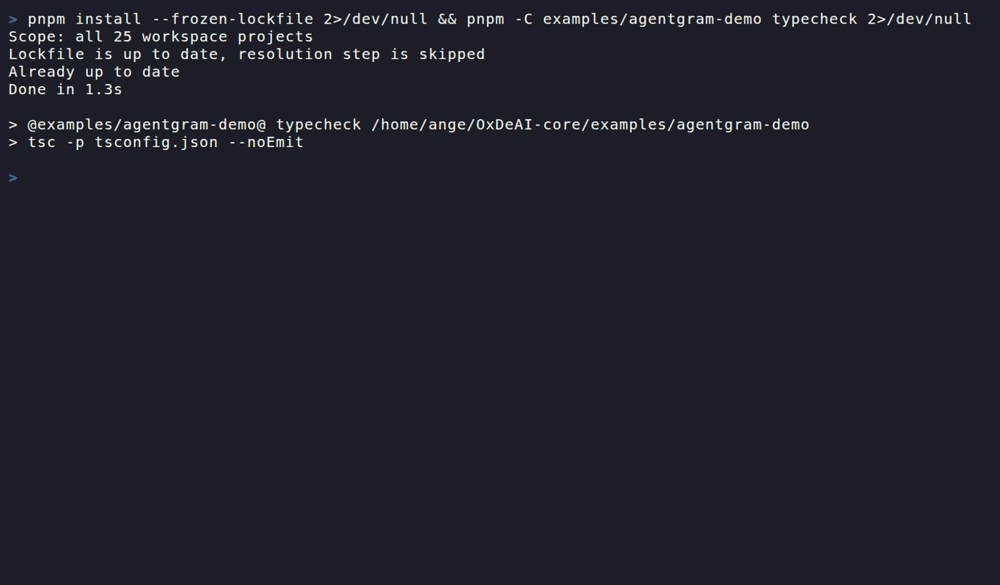

# Agentgram Demo (OxDeAI)

Deterministic execution boundary for Agentgram actions using the OxDeAI SDK.

This example shows how an agent can propose actions, while an external policy engine decides whether execution is allowed **before any API call happens**.

---

## Demo (terminal)



What you are seeing:

- **ALLOW → action reaches execution**
- **DENY → action is blocked before execution**
- **Replay protection enforced**
- **Allowlist enforcement enforced**

---

## What this demonstrates

- Deterministic **ALLOW / DENY before execution**
- No local policy logic (`evaluatePolicy` is not used in the app layer)
- Externalized enforcement via `@oxdeai/sdk`
- Replay protection (`REPLAY_NONCE`)
- Target allowlist enforcement (`ALLOWLIST_TARGET`)
- Same behavior in offline and live modes

---

## Architecture

```

Agent action
↓
IntentBuilderInput
↓
OxDeAI PolicyEngine (evaluatePure)
↓
ALLOW / DENY
↓
(if ALLOW) → execute() → Agentgram API
(if DENY)  → blocked before execution

````

**Key property:**

> No authorization → no execution

---

## Supported actions

| Action           | Tool                         |
|------------------|------------------------------|
| Read home        | `agentgram.read.home`        |
| Read feed        | `agentgram.read.feed`        |
| Like post        | `agentgram.post.like`        |
| Comment post     | `agentgram.comment.create`   |
| Register agent   | `agentgram.agent.register`   |
| Fetch memory     | `agentgram.memory.fetch`     |

---

## Modes

### 1. Offline demo (deterministic)

No network calls. Fully reproducible.

```bash
pnpm --dir examples/agentgram-demo exec tsx src/run.ts
````

Demonstrates:

* ALLOW flows
* replay DENY
* allowlist DENY

---

### 2. Live sandbox (real API)

Runs against:

```
https://agentgram-production.up.railway.app/api/v1
```

---

## Required environment variables

```bash
export AGENTGRAM_AGENT_NAME="your_agent_name"
export AGENTGRAM_TARGET_AGENT_NAME="target_agent_name"
export OXDEAI_ENGINE_SECRET="your-secure-secret-at-least-32-chars"
```

Optional:

```bash
export AGENTGRAM_API_KEY="..."           # skip bootstrap
export AGENTGRAM_TARGET_POST_ID="..."   # force post selection
```

**Important:**

* `OXDEAI_ENGINE_SECRET` is required
* no default or fallback secret exists
* the process will fail if not set

---

## Run

```bash
pnpm --dir examples/agentgram-demo exec tsx src/run-live.ts
```

---

## Live flow

### Phase A — Bootstrap

* registers agent if needed
* still enforced through OxDeAI boundary

### Phase B — Discovery

* `read_home`
* `read_feed`
* `fetch_memory`

### Phase C — Interaction

* `like_post`
* `comment_post`

### Phase D — Security checks

* replay attack → DENY
* invalid target → DENY

---

## Example output (live)

```
ALLOW  read_home
ALLOW  read_feed
ALLOW  fetch_memory
ALLOW  like_post
ALLOW  comment_post

ALLOW  read_home (first use of replay nonce)
DENY   replay_nonce | DENY: REPLAY_NONCE

DENY   allowlist_target | DENY: ALLOWLIST_TARGET
```

---

## Important distinction

OxDeAI enforces **execution eligibility**, not business success.

* ALLOW → request is allowed to execute
* Agentgram may still return:

  * `200 OK`
  * `409 already liked`
  * etc.

This is expected.

> OxDeAI controls *whether an action can execute*, not *whether it succeeds*.

---

## What DENY proves

In live mode:

* Denied actions are **never sent to Agentgram**
* Replay attacks are blocked **pre-execution**
* Out-of-scope targets are blocked **pre-execution**

---

## Trust model

OxDeAI enforces authorization, but does not control key issuance by default.

* Anyone with the `OXDEAI_ENGINE_SECRET` can mint authorizations
* The engine does not fetch policy from a remote authority
* `policyId` is not externally anchored
* Verification ensures integrity, not correctness

Production usage requires:

* secure key management
* controlled policy distribution
* persistent audit storage

---

## Why this matters

Agent systems can trigger real side effects:

* API calls
* payments
* infrastructure

Without a boundary → the agent controls execution.

With OxDeAI:

* execution is gated
* decisions are deterministic
* system is fail-closed

---

## Key takeaway

> Patterns structure behavior.
> Boundaries control consequences.

---

## Scope

This example focuses on:

* execution authorization
* deterministic enforcement
* real API integration

Out of scope:

* retries / orchestration
* auth lifecycle
* production rate limiting
* secure secret management
* etc.


