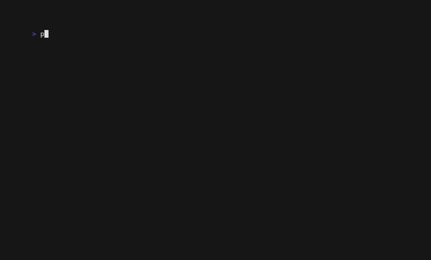

# OxDeAI - Pre-Execution Authorization Boundary

Authorization is evaluated **before** a tool executes. Not monitored after. Not logged after. Before.



---

> **Invariant:** No signed Authorization artifact → no execution. The tool code is unreachable on DENY.

---

## What this demo proves

- A policy boundary can block tool execution structurally - not by rate-limiting or alerting
- DENY means the tool function is never called - no code path reaches it
- ALLOW requires a signed artifact at the PEP boundary, not just a truthy return value
- The full decision history is independently verifiable offline, without re-running the engine

---

## Scenario

An agent proposes the same GPU provisioning call three times. The policy budget allows exactly two.

```
#1  provision_gpu(a100, us-east-1)  →  ALLOW   500 / 1000 spent
#2  provision_gpu(a100, us-east-1)  →  ALLOW  1000 / 1000 spent
#3  provision_gpu(a100, us-east-1)  →  DENY   BUDGET_EXCEEDED - tool never called
```

---

## Architecture

```
Agent
  │  proposed tool call
  ▼
PEP  (pep.ts)          ← enforcement point - thin by design, no policy logic
  │
  ├─ evaluatePure(intent, state)
  │     ├─ DENY  → return denial, execution structurally blocked
  │     └─ ALLOW → Authorization artifact issued
  │
  ├─ assert Authorization present      ← fail-closed invariant
  ├─ call tool only after assertion    ← execution boundary
  └─ commit nextState from PDP
  ▼
PDP  (policy.ts)       ← decision point - deterministic, pure, no side effects
  │
  │  modules: KillSwitch · Allowlist · Budget · PerActionCap
  │           Velocity · Replay · Concurrency · Recursion · ToolAmplification
  │
  └─ returns { decision, authorization?, nextState?, reasons? }
```

**PDP** decides. **PEP** enforces. Neither does the other's job.

---

## Execution flow

1. Agent proposes `provision_gpu(asset, region)`
2. PEP builds an Intent and calls `evaluatePure(intent, state)`
3. **DENY** → PEP returns denial; tool is never invoked
4. **ALLOW** → PEP asserts the Authorization artifact is present (throws if missing)
5. PEP calls the tool; commits `nextState` from the PDP result
6. Audit chain records every decision, hash-linked
7. A Verification Envelope is produced for offline verification

---

## Run

```bash
pnpm -C examples/openai-tools demo
```

Zero-setup local demo (no API keys, no secrets to export, no browser). Tool execution is mocked; the authorization boundary is real. A built-in demo engine secret is used by default.

---

## Expected outcome

```
proposal 1: ALLOW
proposal 2: ALLOW
proposal 3: DENY   ← BUDGET_EXCEEDED

Run 1 complete.  Artifact produced.
...
Replay passed.  Artifact verified independently - engine not involved.
```

This example is the reference implementation of the shared cross-adapter scenario:
[`docs/archive/integrations/shared-demo-scenario.md`](../../docs/archive/integrations/shared-demo-scenario.md)

---

## Real API demo (OpenAI × OxDeAI)

OpenAI proposes tool calls via the live API. OxDeAI evaluates each at the boundary before execution.

```bash
OPENAI_API_KEY=sk-... pnpm -C examples/openai-tools demo:openai
```

```
#1  provision_gpu(a100, us-east-1)  ALLOW
#2  provision_gpu(a100, us-east-1)  ALLOW
#3  provision_gpu(a100, us-east-1)  DENY   BUDGET_EXCEEDED

✓ verifyEnvelope() => ok
```

OpenAI proposes. OxDeAI enforces. The artifact is independently verifiable.

If OPENAI_API_KEY is missing, the command exits with guidance to run the local demo. Browsers are never auto-opened.

---

## Why this is not monitoring

| Monitoring | OxDeAI |
|---|---|
| Tool runs, then alert fires | Tool never runs on DENY |
| Soft limit, can be exceeded | Hard pre-execution gate |
| Log after the fact | Signed artifact before execution |
| Re-run engine to verify | Verify offline from artifact alone |

The boundary is structural. DENY means no code path reaches the tool.

---

## Determinism

- **Timestamps** - fixed `DEMO_BASE_TIMESTAMP = 1_700_000_000`, no `Date.now()`
- **Instance IDs** - stable counter (`a100-us-east-1-demo-1`, `-demo-2`), no random entropy
- **Cost table** - static map in `policy.ts`, no runtime lookup
- **State transitions** - always via `result.nextState` from `evaluatePure`, never mutated in place
