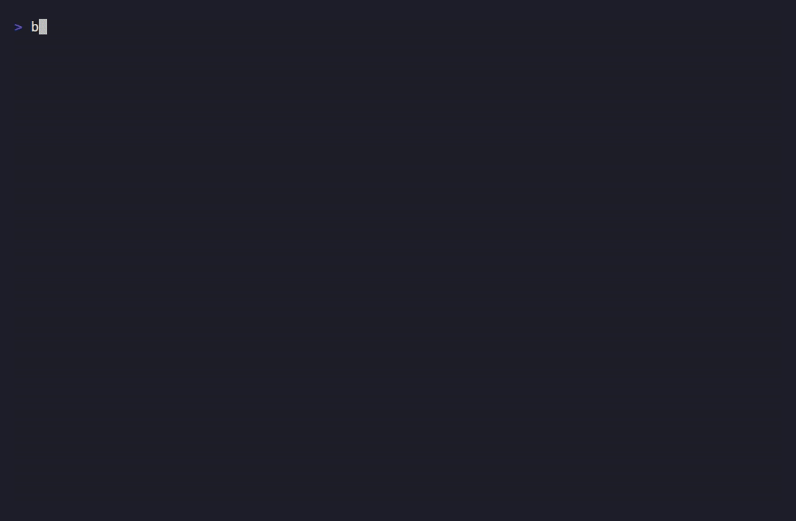

# OpenClaw Integration Demo

OpenClaw-shaped integration demo showing OxDeAI as the deterministic authorization boundary.

The PEP layer uses [`@oxdeai/openclaw`](../../packages/openclaw/README.md) — a thin adapter that maps OpenClaw actions (`{ name, args, step_id, workflow_id }`) to the universal guard. No authorization logic lives in this example.

## Run

```bash
pnpm -C examples/openclaw start
```

Expected sequence: `ALLOW`, `ALLOW`, `DENY` with strict `verifyEnvelope()` result `ok`.

Demo capture:



See the canonical shared scenario: [`docs/archive/integrations/shared-demo-scenario.md`](../../docs/archive/integrations/shared-demo-scenario.md).

> Note: If `OXDEAI_ENGINE_SECRET` is not set, the demo falls back to a bundled demo secret. Set your own secret for non-demo use.
