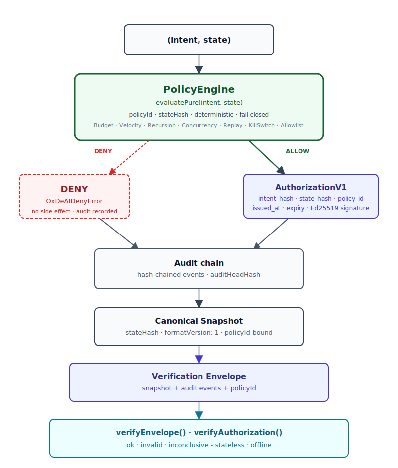
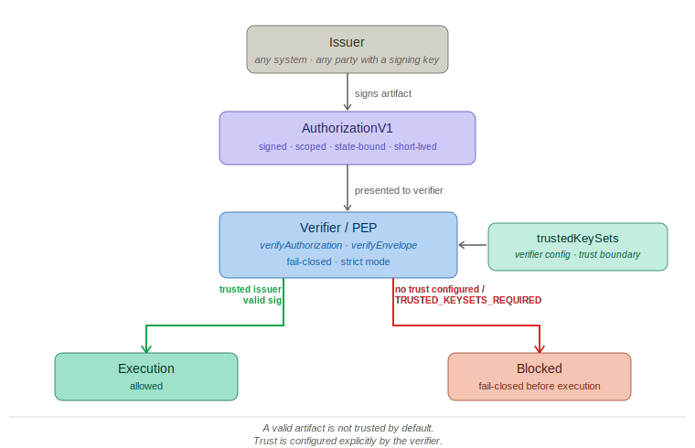

# @oxdeai/core

Deterministic Execution Authorization Layer for Autonomous Systems

[](https://www.npmjs.com/package/@oxdeai/core)
[](https://snyk.io/test/github/AngeYobo/oxdeai-core)
[](https://github.com/AngeYobo/oxdeai-core/blob/main/packages/core/LICENSE)
[](https://github.com/AngeYobo/oxdeai-core/actions/workflows/ci.yml)


## Status

`@oxdeai/core` is a stable protocol library.

Current protocol stack line: **v1.7.x**.

v1.7.x adds on top of the preserved v1.6.x verification surface:

- `createVerifier` with explicit `trustedKeySets` as the PEP-side trust entry point
- Strict mode fails closed when no `trustedKeySets` configured (`TRUSTED_KEYSETS_REQUIRED`)
- Trust boundary made explicit in API, documentation, and CLI tooling
- Conformance suite: deterministic secret fixture, env var override removed

Preserved from v1.6.x:

- `DelegationV1` — first-class delegation artifact
- `verifyDelegation()` / `verifyDelegationChain()` — stateless delegation verifiers
- `createDelegation()` — delegation signing helper
- Scope narrowing enforcement (budget ceiling, tool allowlist, expiry ceiling)

Preserved stateless verification surface (v1.2+):

- `verifySnapshot`, `verifyAuditEvents`, `verifyEnvelope`, `verifyAuthorization`
- `VerificationResult` schema, `VerificationEnvelopeV1` format
- Ed25519 signatures, `alg` / `kid` fields, KeySet-based key resolution

Validation status:

- conformance suite: **continuously validated via CI** [](https://github.com/AngeYobo/oxdeai-core/actions/workflows/ci.yml)
- working demos (all produce `ALLOW`, `ALLOW`, `DENY`, `verifyEnvelope() => ok`):
  - `examples/openai-tools` (protocol reference)
  - `examples/langgraph`
  - `examples/crewai`
  - `examples/openai-agents-sdk`
  - `examples/autogen`
  - `examples/openclaw`

Future protocol releases maintain backward compatibility for frozen verification artifacts unless a major protocol version declares otherwise.

---


`@oxdeai/core` is the TypeScript reference library for deterministic execution authorization in autonomous systems. It evaluates whether a proposed action is allowed under the current policy state before any side effect occurs, and emits a cryptographically verifiable authorization artifact on every allowed action.

It answers a narrow question:

> Given an intent, a state, and a policy configuration, is this action allowed to execute - deterministically?

If allowed, it emits a signed, expiring authorization bound to the intent and state snapshot.
If denied, it fails closed.

No dashboards.
No LLM classifiers.
No heuristics.
No post-fact monitoring.

Just deterministic pre-execution authorization with verifiable artifacts.

`@oxdeai/core` sits at the execution boundary of agent runtimes and external systems.

---

## Overview

`@oxdeai/core` is the TypeScript reference implementation of the OxDeAI execution authorization protocol.

It enforces authorization invariants before an action executes and emits cryptographically verifiable artifacts that can be verified independently - offline, without access to the running system.

The library exposes:

* deterministic policy evaluation
* signed authorization artifacts (`AuthorizationV1`)
* canonical state snapshots
* hash-chained audit events
* stateless verification primitives

---

## Key Concepts

### PolicyEngine

Deterministic evaluation of action intents against a policy state.

### Canonical Snapshot

Deterministic binary representation of the policy state.

### Audit Chain

Hash-chained sequence of execution events.

### DelegationV1

First-class authorization artifact enabling scoped delegation from a parent `AuthorizationV1`.
A delegation narrows the parent's scope (budget ceiling, tool allowlist, expiry)
and is cryptographically bound to the parent `AuthorizationV1` via `parent_auth_hash`.

### VerificationEnvelopeV1

Portable artifact combining:

* snapshot
* audit events
* policy identity

---

## Stateless Verification

Stateless verification API:

* `verifySnapshot(snapshotBytes)`
* `verifyAuditEvents(events)`
* `verifyEnvelope(envelopeBytes)`
* `verifyAuthorization(auth, opts?)`

All return `VerificationResult` with status:

* `ok`
* `invalid`
* `inconclusive`

---

## The Problem

Autonomous systems often fail operationally before they fail semantically.

Common failure modes:

* runaway tool-call loops
* recursive planning explosions
* uncontrolled concurrency
* replayed actions
* silent resource exhaustion
* unbounded external side effects

Most “guardrails” operate after execution or rely on probabilistic models.

Execution authorization decisions should not be probabilistic.

---

## What This Library Is

A deterministic execution authorization substrate that:

* evaluates `(intent, state, policy)` → stable, reproducible decision
* emits signed `AuthorizationV1` artifacts (Ed25519-based signatures; legacy HMAC paths available for compatibility only)
* enforces policy domains as authorization invariants:
  * budget - per-period spend caps
  * velocity - rate and window limits
  * concurrency - parallel slot control
  * recursion - depth limits
  * replay - nonce-based replay protection
  * capability - allowlists and kill switches
* produces hash-chained, tamper-evident audit logs
* supports pure evaluation (`evaluatePure`) - no side effects
* produces content-addressed `policyId`, canonical `stateHash`, tamper-evident `auditHeadHash`
* packages snapshot + audit events into a portable `VerificationEnvelopeV1`
* exposes stateless verifiers: `verifySnapshot`, `verifyAuditEvents`, `verifyEnvelope`, `verifyAuthorization`

Same inputs ⇒ same outputs. Policy domains are enforced as deterministic authorization invariants.

---

## What This Library Is Not

* Not a billing system or metering pipeline
* Not a cloud budget monitor or cost dashboard
* Not a reservation or settlement ledger
* Not a prompt filter or model-output classifier
* Not an observability or post-execution monitoring tool
* Not distributed coordination infrastructure

`@oxdeai/core` can enforce spend, velocity, concurrency, and capability policies as authorization invariants. Its core role is execution authorization and verifiable artifacts - not downstream accounting.

---

## Deterministic Guarantees

Deterministic invariants enforced and tested:

* I1 Canonical hashing ignores key insertion order
* I2 Snapshot round-trip is idempotent
* I3 Decision equivalence across import/export
* I4 Replay verification determinism
* I5 Cross-process determinism
* I6 Evaluation isolation - concurrent evaluations must not share mutable state (`getState: () => structuredClone(state)`)
* D-1 `evaluatePure` produces identical outputs for identical inputs across repeated calls
* D-2 `evaluatePure` does not mutate the input state
* D-3 `structuredClone` inputs yield identical outputs (no aliasing between clone and engine working state)
* D-4 Object key insertion order does not affect decisions or derived hashes
* D-5 Same inputs produce identical decisions and state hashes across separate processes
* D-6 Strict mode rejects missing explicit time inputs — no implicit `Date.now()` fallback

* `policyId` - content-addressed engine configuration
* `stateHash` - canonical snapshot hash
* `auditHeadHash` - tamper-evident execution trace hash
* `formatVersion: 1` for canonical snapshots
* canonical JSON snapshot payloads (`modules: Record<string, unknown>`)
* portability across runtimes (no v8 blobs in snapshots)
* decode validation rejects malformed snapshots

If the engine version, module set, state, and event sequence are the same, these hashes are identical across runs.

Intent identity is canonical and signature-stripped.

Strict mode removes implicit entropy sources.

---

## Show me the invariant

```ts
const out = engine.evaluatePure(intent, state);
if (out.decision !== "ALLOW") throw new Error(out.reasons.join(", "));
const policyId = engine.computePolicyId();
const stateHash = engine.computeStateHash(out.nextState);
const auditHead = engine.audit.headHash();
console.log(policyId, stateHash, auditHead);
```

**Invariant:**

Same `(engine version + modules + options + state + intent sequence)`
⇒ identical `policyId`, `stateHash`, and `auditHead`.

No randomness.
No hidden clocks (in strict mode).
No non-deterministic ordering.

---

## Minimal Example

```ts
import { PolicyEngine, verifyEnvelope } from "@oxdeai/core";
const decision = engine.evaluate(intent, state);
const result = verifyEnvelope(envelopeBytes);
if (result.ok) console.log("artifact verified");
// result.ok is true only when the envelope contains a STATE_CHECKPOINT.
// Set checkpoint_every_n_events: 1 (or N) in the engine options to emit one.
```

---

## Design Philosophy

* Fail closed.
* Make invariants explicit.
* Make state portable.
* Make execution replayable.
* Separate identity from proof.
* Prefer deterministic containment over probabilistic detection.

---

## Installation

```bash
npm install @oxdeai/core
```

---

## Core Model



Diagram source/editing policy:
- [`docs/diagrams/README.md`](../../docs/diagrams/README.md)

---

## Trust Boundary



The core model shows **what the protocol decides** (deterministic authorization logic).
This diagram shows **who is trusted to make that decision** (issuer model + verifier configuration).

The two concerns are deliberately separate:

- Any party that controls a signing key can produce a cryptographically valid artifact. The protocol does not prevent this.
- A cryptographically valid artifact is not trusted by default.
- The verifier defines the trust boundary via `trustedKeySets`.
- In strict mode, a missing or empty `trustedKeySets` is a hard failure (`TRUSTED_KEYSETS_REQUIRED`), not a warning.

`policyId` is a content hash of the policy configuration — it identifies a specific policy but does not authenticate the authority that defined it. Verifiers MUST NOT treat a matching `policyId` as proof of issuer legitimacy.

Trust is configured explicitly at the verifier. OxDeAI enforces the execution boundary; who is trusted is defined outside the protocol.

---

## Concepts

### Intent

A structured authorization action.

Examples:

* `EXECUTE` a paid tool call
* `RELEASE` an authorization-bound concurrency slot

---

### State

Deterministic policy state containing:

* per-agent budgets
* per-action caps
* velocity windows
* replay nonce windows
* recursion depth caps
* concurrency caps + active authorizations
* tool amplification limits
* kill switches and allowlists

---

### Authorization

If an intent is allowed, the engine emits AuthorizationV1:

* `auth_id`, `issuer`, `audience`
* `intent_hash`, `state_hash`, `policy_id`
* `issued_at`, `expiry`, `decision`
* optional `nonce`, `capability`, `signature`
* verified pre-execution via `verifyAuthorization()`

Verification envelopes remain post-execution evidence artifacts verified with `verifyEnvelope()`.

---

## Example: Pure Evaluation

```ts
import { PolicyEngine } from "@oxdeai/core";
import type { State, Intent } from "@oxdeai/core";

// Policy configuration is bound in the engine instance.
// evaluatePure(intent, state) evaluates against that bound policy.
const engine = new PolicyEngine({
  policy_version: "v1.7",
  authorization_ttl_seconds: 60,
  authorization_signing_alg: "Ed25519",
  authorization_private_key_pem: process.env.OXDEAI_SIGNING_KEY_PEM!,
  engine_secret: process.env.OXDEAI_ENGINE_SECRET!,
  strictDeterminism: true
});

const now = 1730000000; // injected timestamp (seconds)

const state: State = {
  policy_version: "v1.7",
  period_id: "2026-02",
  kill_switch: { global: false, agents: {} },
  allowlists: {},
  budget: { budget_limit: { "agent-1": 10_000n }, spent_in_period: { "agent-1": 0n } },
  max_amount_per_action: { "agent-1": 5_000n },
  velocity: { config: { window_seconds: 60, max_actions: 100 }, counters: {} },
  replay: { window_seconds: 3600, max_nonces_per_agent: 256, nonces: {} },
  recursion: { max_depth: { "agent-1": 2 } },
  concurrency: { max_concurrent: { "agent-1": 2 }, active: {}, active_auths: {} },
  tool_limits: { window_seconds: 60, max_calls: { "agent-1": 10 }, calls: {} }
};
// policy_version must match engine.opts.policy_version — evaluatePure fails-closed on mismatch

const intent: Intent = {
  intent_id: "intent-1",
  agent_id: "agent-1",
  action_type: "PAYMENT",
  target: "openai-api",
  metadata_hash: "0".repeat(64),
  signature: "",
  type: "EXECUTE",
  tool_call: true,
  tool: "openai.responses",
  nonce: 42n,
  amount: 100n,
  timestamp: now,
  depth: 0
};

const out = engine.evaluatePure(intent, state, { mode: "fail-fast" });

if (out.decision === "DENY") {
  console.error(out.reasons);
} else {
  // persist out.nextState
  // execute using out.authorization
}
```

---

## Concurrency Lifecycle: RELEASE

`RELEASE` must reference a valid active `authorization_id`.

```ts
if (out.decision === "DENY") {
  throw new Error("RELEASE requires a prior allowed EXECUTE with an active authorization");
}

const releaseIntent: Intent = {
  intent_id: "intent-2",
  agent_id: "agent-1",
  action_type: "PAYMENT",
  target: "openai-api",
  metadata_hash: "0".repeat(64),
  signature: "",
  type: "RELEASE",
  authorization_id: out.authorization.authorization_id,
  nonce: 43n,
  amount: 0n,
  timestamp: now
};

const rel = engine.evaluatePure(releaseIntent, out.nextState);
```

---

## Built-In Modules

* KillSwitchModule
* AllowlistModule
* ReplayModule
* RecursionDepthModule
* ConcurrencyModule
* ToolAmplificationModule
* BudgetModule
* VelocityModule

---

## Determinism and Auditability

* Pure evaluation mode available
* Stable canonical JSON encoding
* BigInt normalization
* Sorted key hashing
* Hash-chained audit log
* Strict-mode clock injection
* Property-based determinism tests (seeded, no deps): I1–I5 (`property.test.ts`), D-1–D-6 decision-path determinism (`property.decision.test.ts`), delegation chain D-P1–D-P5 (`delegation.property.test.ts`), cross-adapter CA-1–CA-10 (`@oxdeai/compat`)

---

## Canonical Snapshot API

```ts
import {
  PolicyEngine,
  encodeCanonicalState,
  decodeCanonicalState
} from "@oxdeai/core";

// 1. Export canonical snapshot
const snapshot = engine.exportState(state);
// 2. Encode to portable bytes (canonical JSON)
const bytes = encodeCanonicalState(snapshot);
// 3. Decode in another process/runtime
const decoded = decodeCanonicalState(bytes);
// 4. Import into fresh state container
const freshState = structuredClone(state);
engine.importState(freshState, decoded);
engine.computeStateHash(freshState); // deterministically identical stateHash
```

`importState` enforces:

- `formatVersion: 1`
- policy binding (`policyId` must match `engine.computePolicyId()`)

Snapshots are:

- Canonical JSON (no v8 serialization)
- Versioned (`formatVersion: 1`)
- Policy-bound (policyId must match)
- Deterministically hashed

Snapshots are portable, deterministic, and verifiable across runtimes.

---

## Adapters (v0.8)

```ts
import { PolicyEngine } from "@oxdeai/core";
import { FileStateStore, FileAuditSink } from "@oxdeai/core/adapters";

const stateStore = new FileStateStore("./policy-state.bin");
const auditSink = new FileAuditSink("./audit.ndjson");

const engine = new PolicyEngine({
  policy_version: "v1.7",
  authorization_ttl_seconds: 60,
  authorization_signing_alg: "Ed25519",
  authorization_private_key_pem: process.env.OXDEAI_SIGNING_KEY_PEM!,
  engine_secret: process.env.OXDEAI_ENGINE_SECRET!,
  stateStore,
  auditSink
});

const out = engine.evaluate(intent, state);
engine.commitState(state);
await engine.flushAudit();
await engine.flushState();
```

Core ships only minimal in-memory and file adapters; no redis/postgres adapters in core. Build those in separate packages.

---

## Replay Verification (v0.7)

Replay verification uses the public stateless verifier surface.
In strict mode, verification returns `ok` once the audit trace includes at least one `STATE_CHECKPOINT`.

`verifyAuditEvents(...)` recomputes `auditHeadHash` offline from the provided audit events, and validates policy binding (`policyId`) plus non-decreasing timestamps.

```ts
import { PolicyEngine, verifyAuditEvents } from "@oxdeai/core";
const engine = new PolicyEngine({
  policy_version: "v1.7",
  authorization_ttl_seconds: 60,
  authorization_signing_alg: "Ed25519",
  authorization_private_key_pem: process.env.OXDEAI_SIGNING_KEY_PEM!,
  checkpoint_every_n_events: 2
});
const first = engine.evaluatePure(intent1, state);
if (first.decision !== "ALLOW") throw new Error(first.reasons.join(", "));
const out = engine.evaluatePure(intent2, first.nextState);
const events = engine.audit.snapshot();
const verified = verifyAuditEvents(events, { policyId: engine.computePolicyId() }); // strict by default
console.log(verified.ok, verified.status); // true, "ok" when checkpoints exist
```

---

## Benchmarks

Adds ~80–150µs per action (p50) for the full protected path (evaluation + authorization verification).

Negligible compared to multi-second agent loops.

The protected path includes deterministic policy evaluation and authorization verification before execution becomes reachable.

## Roadmap

### v0.6 - Stateful Canonical Snapshots (shipped)

* State-bound module codecs (canonical JSON)
* Snapshot round-trip invariants (smoke + property tests)
* Versioned canonical snapshot format (formatVersion=1)
* Strict determinism completeness (no implicit entropy)

### v0.7 - Replay as Verification (shipped)

* Replay verification API
* Optional deterministic state checkpoints (`STATE_CHECKPOINT`)
* Misuse hardening (`strict` => `inconclusive` without state anchors)

### v0.8 - Host Integration Adapters (shipped)

* StateStore interface
* AuditSink interface
* Minimal in-memory + file adapters

### v0.9 - Stateless Verification Surface (shipped)

Stateless verification layer for protocol artifacts.

* Pure verifiers: `verifySnapshot`, `verifyAuditEvents`, `verifyEnvelope`
* Portable Verification Envelope (snapshot + audit events)
* Unified `VerificationResult` (`ok` / `invalid` / `inconclusive`)
* Deterministic violation ordering

### v1.0.3 - Stable Protocol Core (shipped)
* deterministic policy engine
* canonical snapshots
* hash-chained audit
* stateless verification
* verification envelope
* conformance tests
* reference integration demo (OpenAI tools boundary)

### v1.1 - Authorization Artifact (shipped)
* formalize AuthorizationV1 as first-class protocol artifact
* relying-party verification contract
* verifyAuthorization() as explicit protocol primitive
* spec updates for PDP / PEP separation

### v1.2 - Non-Forgeable Verification (shipped)
* Ed25519 support
* kid / alg fields
* public-key verification
* future keyset / rotation model

### v1.3 - Guard Adapter + Integration Surface (shipped)
* `@oxdeai/guard` - universal PEP package, all adapters delegate here
* `@oxdeai/sdk` - stable integration surface
* `@oxdeai/cli` - `build`, `verify`, `replay` tooling

### v1.4 - Ecosystem Adoption (shipped)
* 5 runtime adapter packages: `@oxdeai/langgraph`, `@oxdeai/openai-agents`, `@oxdeai/crewai`, `@oxdeai/autogen`, `@oxdeai/openclaw`
* shared adapter contract and cross-adapter validation
* integration documentation for all maintained adapters
* case studies: API cost containment, infrastructure provisioning control

### v1.5 - Developer Experience (shipped)
* demo GIFs and visual architecture diagrams
* improved quickstart and architecture explainer
* cross-links between protocol, integrations, and cases

### v1.6 - Delegated Agent Authorization (shipped)

* `DelegationV1` - chain-of-trust delegation from principal to sub-agent
* Scope narrowing enforcement (budget ceiling, tool allowlist, expiry ceiling)
* `verifyDelegation()` / `verifyDelegationChain()` stateless verifiers
* `delegationParentHash` - cryptographic binding to the parent `AuthorizationV1` via `parent_auth_hash`
* Property-based coverage: D-P1 through D-P5 (`delegation.property.test.ts`)
* Cross-adapter delegation guard tests: G-D1 through G-D3 (`@oxdeai/guard`)

### v1.7 - Explicit Trust Boundary (shipped)

* `createVerifier` with explicit `trustedKeySets` as the canonical PEP-side entry point
* Strict mode fails closed with `TRUSTED_KEYSETS_REQUIRED` when no keyset is configured
* Trust boundary diagram and architecture documentation
* CLI: all strict verification entry points require `--trusted-keyset` or `--mode best-effort`
* `@oxdeai/sdk@1.3.2`: JSDoc clarifications pointing to `createVerifier` and explicit trust
* Conformance: deterministic secret fixture, env var override removed from validator

### v2.x - Verifiable Execution Infrastructure (planned)

- deterministic execution receipts
- binary Merkle batching of receipt hashes
- proof-of-inclusion for individual receipts
- optional on-chain proof anchoring / smart-contract verifier
- authorization remains off-chain-first

## See also

- [Root README](../../README.md)
- [Architecture](../../docs/architecture.md)
- [Why OxDeAI](../../docs/architecture/why-oxdeai.md)
- [Adapter stack](../../docs/integrations/adapter-stack.md)
- [Integrations index](../../docs/integrations/README.md)
- [Conformance vectors](../../docs/conformance-vectors.md)

## License

Apache-2.0
